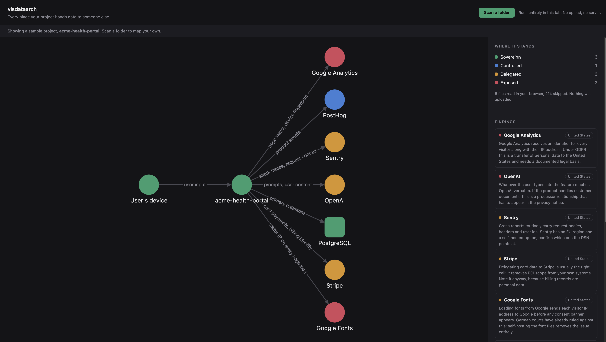

# visdataarch

Scan a codebase and see every point where data leaves your control.

The scan runs entirely inside the browser tab. No file is uploaded, no server is
involved. A tool that argues for data sovereignty should not require you to hand
over your source code in order to make the argument.



## Run it

```bash
npm install
npm run dev
```

Open http://localhost:5173. A sample project is rendered on load, so you see a
working map before scanning anything. "Scan a folder" reads a real directory:
Chromium uses the File System Access API, other browsers fall back to a
directory `<input>`.

## How it fits together

```
src/core/types.ts       the contract between the two halves. Freeze it early.
src/core/rules.ts       detection rules, one object per vendor. Pure data.
src/core/scanner.ts     pure function: ScannedFile[] -> ScanResult
src/core/fileSource.ts  browser-side directory reading
src/core/fixtures.ts    a synthetic project run through the real scanner
src/ui/theme.ts         shared visual language: colours, labels, wording
src/ui/GraphView.tsx    Cytoscape graph
src/ui/SovereigntyPanel.tsx  findings, evidence, legend
```

`ScanResult` is the only thing that crosses between `core/` and `ui/`. As long
as both sides respect it, the scanner and the visualisation can be built at the
same time without blocking each other. `fixtures.ts` exists so the UI always has
real scanner output to render, even before new rules land.

## The two concepts the UI is built around

**Jurisdiction** is where the bytes physically sit. **Sovereignty** is how much
control you still have over them once they are there. They are independent: data
in an EU datacentre operated by a US company is `eu` and `delegated` at the same
time, and conflating the two is the most common mistake in this space.

Four sovereignty levels, in order of losing control:

| Level        | Meaning                                                                 |
| ------------ | ----------------------------------------------------------------------- |
| `sovereign`  | You run the machine and hold the keys.                                   |
| `controlled` | Someone else runs it, but the region and the data are yours to move.     |
| `delegated`  | A third party holds readable data under a contract.                      |
| `exposed`    | A third party holds readable data and may use it for their own purposes. |

## Adding a rule

Append one object to `RULES` in [src/rules](src/core/rules.ts). Nothing else
changes: the scanner picks it up, a node appears in the graph, a finding appears
in the panel.

```ts
{
  id: 'analytics.plausible',
  vendor: 'Plausible',
  kind: 'thirdParty',
  jurisdiction: 'eu',
  sovereignty: 'controlled',
  dataClasses: ['telemetry'],
  patterns: [/plausible\.io\/js/],
  flowLabel: 'aggregate page views',
  severity: 'info',
  explain: 'Plausible is EU-hosted and stores no per-visitor identifier.',
}
```

Keep patterns narrow. Match import paths, SDK constructors and hostnames, never
bare brand names, or a comment mentioning a vendor will produce a false positive.

## Deployment

Pushing to `main` builds and publishes to GitHub Pages via
[.github/workflows/deploy.yml](.github/workflows/deploy.yml). The Vite `base` is
relative, so the same build works locally and from the Pages sub-path.
